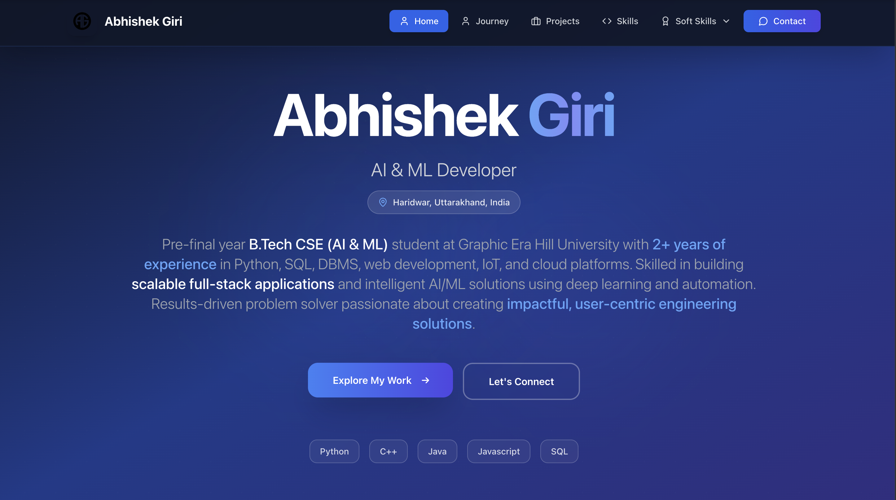
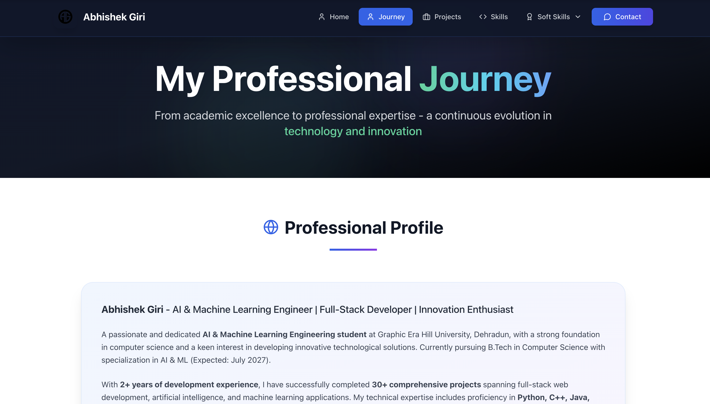
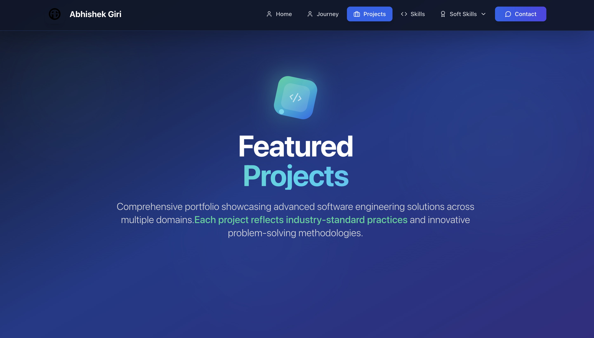
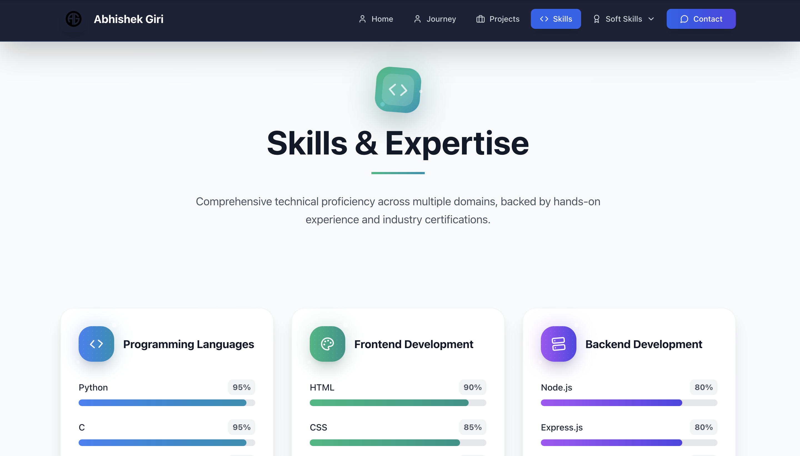
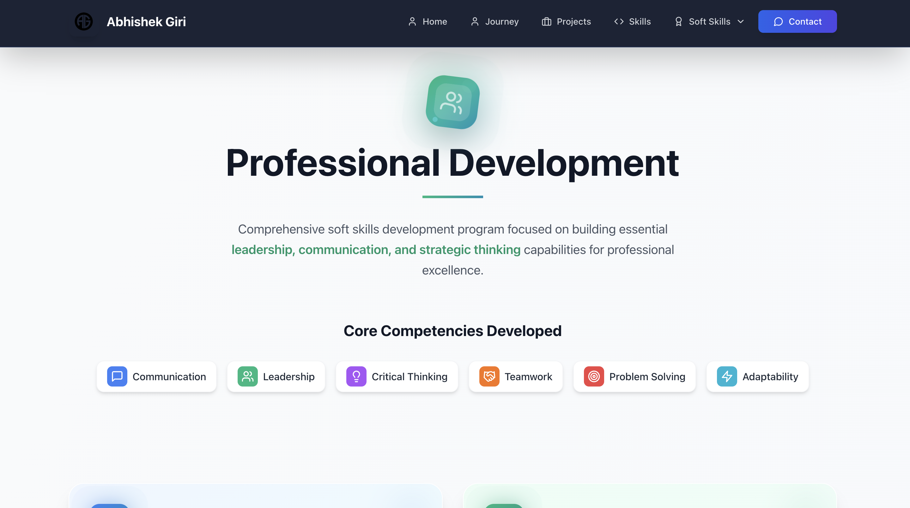
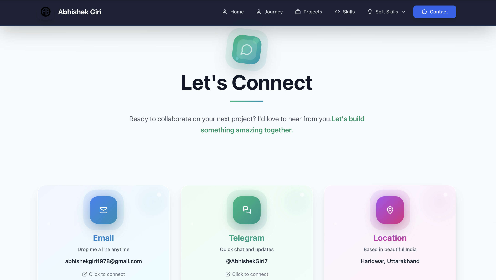

<h1 align="center">🚀 Portfolio-Nexus — Modern Developer Portfolio</h1>

<p align="center">
  ✨ Hi, I'm Abhishek Giri! Explore my portfolio to discover my work as a passionate developer — creating smart, creative, and impactful tech projects that turn ideas into reality.
</p>

<p align="center">
  
  
  
  
  
  
</p>
<br>

---

## 📖 About This Portfolio
A modern, interactive developer portfolio showcasing my journey as an AI & ML Engineering student with expertise in full-stack development, machine learning, and innovative technology solutions.

<br>

---

## 💡 What You'll Find
Portfolio-Nexus is a comprehensive showcase featuring:

- 🎯 **30+ Professional Projects** across multiple domains
- 🏆 **10 Industry Certifications** from leading tech companies
- 💼 **Professional Journey** and educational background
- 🛠️ **Technical Skills** with interactive progress bars
- 📱 **Responsive Design** with modern animations
- 🎨 **Interactive UI/UX** with smooth transitions

<br>

---  

## 🚀 Features

✅  **Modern Design** with gradient backgrounds and animations  
✅  **30+ Featured Projects** spanning AI/ML, Web Dev, IoT, and more  
✅  **Interactive Skills Section** with animated progress bars  
✅  **Professional Certifications** with verification links  
✅  **Responsive Layout** optimized for all devices  
✅  **Smooth Animations** powered by Framer Motion  
✅  **Fast Performance** with Vite build optimization

<br>

---  

## 🛠️ Tech Stack

<div align="center">

<table>
<thead>
<tr>
<th>🖥️ Technology</th>
<th>⚙️ Description</th>
</tr>
</thead>
<tbody>
<tr>
<td></td>
<td>Modern frontend with component architecture</td>
</tr>
<tr>
<td></td>
<td>Type-safe JavaScript development</td>
</tr>
<tr>
<td></td>
<td>Utility-first CSS framework</td>
</tr>
<tr>
<td></td>
<td>Advanced animations and transitions</td>
</tr>
<tr>
<td></td>
<td>Fast build tool and development server</td>
</tr>
<tr>
<td></td>
<td>Beautiful and consistent icons</td>
</tr>
</tbody>
</table>

</div>

<br>

---

## 📁 Project Directory Structure

```
Portfolio-Nexus/
├── 📂 docs/                        # 📸 Portfolio screenshots
│   ├── 📄 WelcomePage.png          # 🎉 Welcome screen
│   ├── 📄 HomePage.png             # 🏠 Landing page preview
│   ├── 📄 JourneyPage.png          # 🛤️ Journey timeline
│   ├── 📄 ProjectPage.png          # 💼 Projects showcase
│   ├── 📄 SkillsPage.png           # 🛠️ Skills & certifications
│   ├── 📄 SoftSkillsPage.png       # 🧠 Soft skills page
│   └── 📄 Contact.png              # 📞 Contact information
├── 📂 public/                      # 🎨 Static assets
│   ├── 📂 Certificates/            # 🏆 Certificate images (9 files)
│   │   ├── 📄 Certificate1.png     # 🎓 Google Analytics
│   │   ├── 📄 Certificate2.png     # ☁️ Oracle Cloud AI
│   │   ├── 📄 Certificate3.png     # 💻 JavaScript
│   │   ├── 📄 Certificate4.png     # 📱 iOS Development
│   │   ├── 📄 Certificate5.png     # 🗄️ MongoDB
│   │   ├── 📄 Certificate6.png     # ☁️ AWS Solutions Architecture
│   │   ├── 📄 Certificate7.png     # 📊 Deloitte Data Analytics
│   │   ├── 📄 Certificate8.png     # ☁️ Google Cloud
│   │   └── 📄 Certificate9.png     # 📚 Data Mining NPTEL
│   ├── 📂 images/                  # 🖼️ Profile photos
│   │   ├── 📄 AG.png               # 📸 Profile logo
│   │   ├── 📄 Photo1.jpeg          # 📸 Professional photo 1
│   │   ├── 📄 Photo2.jpeg          # 📸 Professional photo 2
│   │   └── 📄 Photo3.jpeg          # 📸 Professional photo 3
│   └── 📄 AbhishekGiriResume.pdf   # 📄 Professional resume
├── 📂 src/                         # 💻 Source code
│   ├── 📂 components/              # 🧩 Reusable components
│   │   ├── 📄 Navbar.tsx           # 🔝 Navigation with icons
│   │   ├── 📄 Footer.tsx           # 🔻 Professional footer
│   │   └── 📄 WelcomeScreen.tsx    # 🎉 Welcome animation
│   ├── 📂 pages/                   # 📄 Main application pages
│   │   ├── 📂 week/                # 📚 Soft skills weekly content
│   │   │   ├── 📄 week1.tsx        # 📝 Week 1 content
│   │   │   ├── 📄 week2.tsx        # 📝 Week 2 content
│   │   │   ├── 📄 week3.tsx        # 📝 Week 3 content
│   │   │   ├── 📄 week4.tsx        # 📝 Week 4 content
│   │   │   ├── 📄 week5.tsx        # 📝 Week 5 content
│   │   │   ├── 📄 week6.tsx        # 📝 Week 6 content
│   │   │   └── 📄 week7.tsx        # 📝 Week 7 content
│   │   ├── 📄 Home.tsx             # 🏠 Hero & stats section
│   │   ├── 📄 Journey.tsx          # 🛤️ Professional timeline
│   │   ├── 📄 Projects.tsx         # 💼 31 project showcase
│   │   ├── 📄 Skills.tsx           # 🛠️ Skills & 10 certificates
│   │   ├── 📄 Contact.tsx          # 📞 Contact form
│   │   ├── 📄 SoftSkills.tsx       # 🧠 Soft skills overview
│   │   └── 📄 SoftSkillsWeek.tsx   # 📅 Weekly soft skills
│   ├── 📄 App.tsx                  # 🚀 Main application router
│   ├── 📄 main.tsx                 # 🎯 React entry point
│   ├── 📄 App.css                  # 🎨 Component styles
│   ├── 📄 index.css                # 🎨 Global Tailwind styles
│   └── 📄 vite-env.d.ts            # 🔧 TypeScript definitions
├── 📄 .env                         # 🔐 Environment variables
├── 📄 .env.example                 # 📋 Environment template
├── 📄 .gitignore                   # 🚫 Git ignore rules
├── 📄 eslint.config.js             # 🔍 ESLint configuration
├── 📄 index.html                   # 🌐 HTML entry point
├── 📄 package.json                 # 📦 Dependencies & scripts
├── 📄 package-lock.json            # 🔒 Dependency lock file
├── 📄 postcss.config.js            # 🎨 PostCSS configuration
├── 📄 tailwind.config.js           # 🎨 Tailwind CSS config
├── 📄 tsconfig.json                # 🔧 TypeScript configuration
├── 📄 tsconfig.app.json            # 🔧 TypeScript app config
├── 📄 tsconfig.node.json           # 🔧 TypeScript node config
├── 📄 vercel.json                  # 🚀 Vercel deployment config
├── 📄 vite.config.ts               # ⚙️ Vite build configuration
└── 📄 README.md                    # 📖 Project documentation
```
<br>

---

## 📸 Portfolio Screenshots

<div align="center">

### 🎉 Welcome Screen


### 🏠 Home Page


### 🛤️ Professional Journey


### 💼 Projects Showcase


### 🛠️ Skills & Certifications


### 🧠 Soft Skills


### 📞 Contact Information


</div>

<br>

---

## 📦 How to Run

### 📌 Prerequisites
- ✅ **Node.js 18+** installed
- ✅ **npm or yarn** package manager

<br>

---  

### 🚀 Quick Start

1. Clone the repository:

   ```bash
   git clone https://github.com/AbhishekGiri04/Portfolio-Nexus.git
   cd Portfolio-Nexus
   ```

2. Install dependencies:

   ```bash
   npm install
   ```

3. Start development server:

   ```bash
   npm run dev
   ```

4. Open in browser:

   ```
   http://localhost:5173
   ```

### 🏗️ Build for Production

```bash
npm run build
```

### 🔍 Preview Production Build

```bash
npm run preview
```

### 🌐 Deploy

**Vercel Deployment:**
1. Connect GitHub Repository to Vercel
2. Build command: `npm run build`
3. Output directory: `dist`
4. Add environment variables from `.env.example`
5. Deploy automatically on every push

<br>

---

## 📖 Core Components

* **WelcomeScreen.tsx** — Animated welcome screen with loading effect
* **Navbar.tsx** — Responsive navigation with icons and animations
* **Home.tsx** — Hero section with professional introduction
* **Journey.tsx** — Educational background and career timeline
* **Projects.tsx** — Showcase of 31 professional projects
* **Skills.tsx** — Interactive skills with 10 certifications
* **SoftSkills.tsx** — Soft skills overview and weekly content
* **Contact.tsx** — Contact form with social links
* **Footer.tsx** — Professional links and contact information

<br>

---


## 🏆 Certifications Showcase

- **Google Analytics** — Google Digital Academy
- **Oracle Cloud AI** — Oracle Certified Associate
- **JavaScript** — GeeksforGeeks
- **iOS Development** — GeeksforGeeks
- **MongoDB** — GeeksforGeeks Developer's Toolkit
- **AWS Solutions Architecture** — Forage Job Simulation
- **Data Analytics** — Deloitte Australia (Forage)
- **Google Cloud** — Simplilearn
- **Data Mining** — NPTEL
- **AWS Certifications** — Amazon Web Services

<br>

---

## 📊 Portfolio Metrics

- **31 Projects** — Comprehensive project portfolio
- **10 Certifications** — Industry-recognized credentials
- **6 Tech Categories** — Diverse technical expertise
- **2+ Years Experience** — Continuous development journey
- **99% Uptime** — Reliable and fast performance

<br>

---

## 🌱 Future Enhancements
- 📱 **Mobile App Version** — React Native portfolio app
- 🌍 **Multi-language Support** — Internationalization
- 📊 **Analytics Dashboard** — Visitor insights and metrics
- 🔐 **Admin Panel** — Dynamic content management
- 🎨 **Theme Customization** — Dark/light mode toggle

<br>

---  

## 📞 Connect With Me  

> 💬 *Interested in collaboration or have questions about my work?*  
> Let's connect and explore opportunities together!

<div align="center">

**👤 Abhishek Giri**  
*AI & ML Engineering Student | Full-Stack Developer*

<a href="https://www.linkedin.com/in/abhishek-giri04/">
  
</a>  
<a href="https://github.com/abhishekgiri04">
  
</a>  
<a href="mailto:abhishekgiri1978@gmail.com">
  
</a>

<br/>

---

**🚀 Built with ❤️ and Modern Web Technologies**  
*Showcasing Innovation Through Code*

</div>

---

<div align="center">

**© 2026 Abhishek Giri. All Rights Reserved.**

</div>